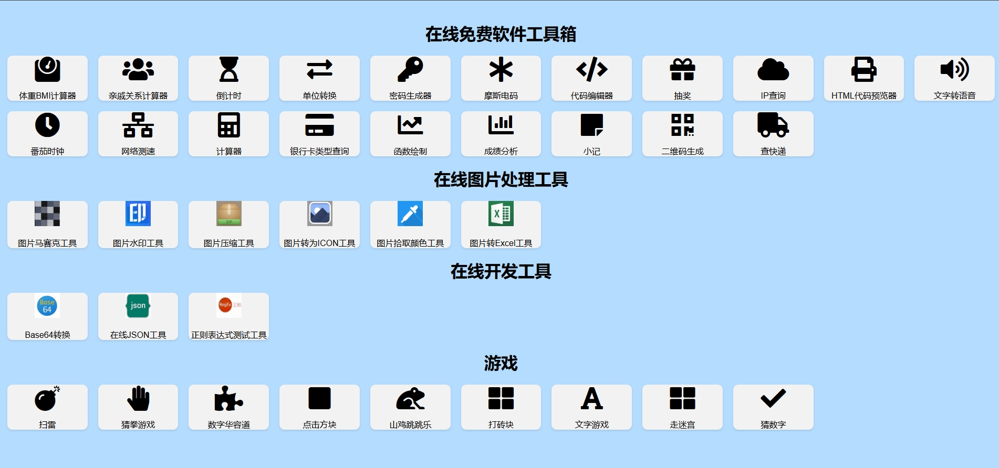

# 在线免费软件工具箱
一款在线免费软件工具箱，无需登录，无需费用，用完就走的软件工具，包有BMI计算、倒计时、单位转换、密码生成器、摩斯电码、代码编辑器、计算器、快递查询、二维码生成、网速测速，还包过有轻松小游戏，有扫雷、猜拳、数字华容道、走迷宫、猜数字、文字游戏以及图片处理工具包有马赛克工具、
 图片水印处理工具、图片压缩、图片转为ICON工具、图片拾取颜色工具、图片转Excel工具和在线开发调试工具有base转换、json格式化、在线正则表达式测试等。
# 官网链接

https://tool.openai2025.com/

# 网站效果：

#### 功能

1、工具

体重BMI计算|
亲戚关系计算器|
倒计时|
单位转换|
密码生成器|
摩斯电码|
代码编辑器|
抽奖|
IP查询|
HTML代码预览器|
文字转语音|
番茄时钟|
网络测速|
计算器|
银行卡类型查询|
函数绘制|
成绩分析|
小记|
二维码生成|
快递查询|

2、在线图片处理工具

图片马赛克工具|
图片水印处理工具|
图片压缩|
图片转为ICON工具|
图片拾取颜色工具|
图片转Excel工具

3、在线开发工具

base64转换|
在线json工具|
正则表达式测试工具

4、游戏

扫雷|
猜拳游戏|
数字华容道|
点击方块|
山鸡跳跳乐|
打砖块|
文字游戏|
走迷宫|
猜数字

